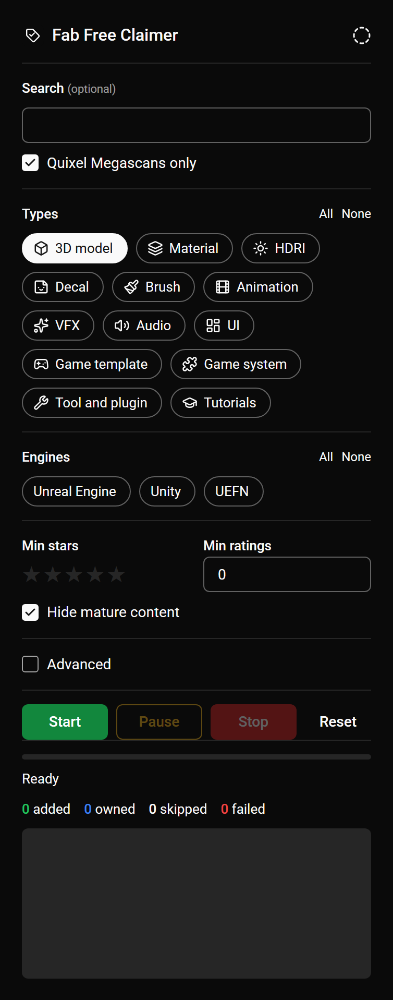
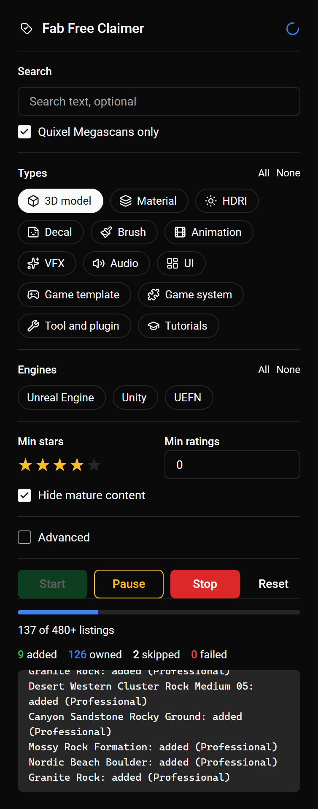
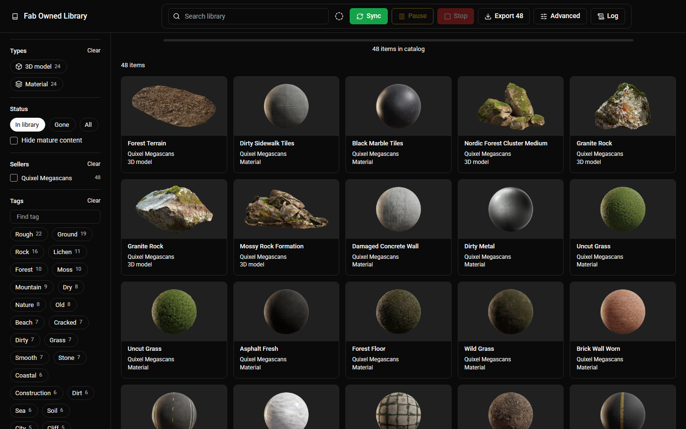

<h1 align="center">Fab Tools</h1>

<p align="center">
  Two unofficial browser extensions for <a href="https://www.fab.com">Fab</a>, for Chrome and Edge.<br>
  <b>Fab Free Claimer</b> adds free listings to your library.
  <b>Fab Owned Library</b> keeps a local catalog of what you own.<br>
  Both exist because Fab makes these two jobs slow by hand.
</p>

## Install

1. Get the extensions from the [latest release](https://github.com/basarersek/fab-tools/releases/latest): one zip per extension. Unzip each into a folder you keep. Or clone this repo and use the `claimer` and `library` folders.
2. Open `chrome://extensions` or `edge://extensions`.
3. Turn on **Developer mode** at the top right.
4. Click **Load unpacked** and pick the unzipped folder. Repeat for the second extension.
5. Log in to [fab.com](https://www.fab.com) in the same browser.

Chrome only installs packed extensions from its Web Store, so these come as zip files. To update, unzip the new release over the old folder and press the reload icon on the extensions page.

Both extensions run a small script inside your fab.com tab. They call the same endpoints the Fab site uses, with your own login session. Nothing is downloaded. No data leaves your browser.

## Fab Free Claimer

<p align="center">
  
</p>

<p align="center">
  
  &nbsp;&nbsp;
  
</p>

### Why

Fab has thousands of free listings, and each one takes a click, a license choice, and a page load to claim. Nobody does that two thousand times. This extension does the clicking for you, with filters so you only take what you want, at a pace that does not hammer Fab.

### What it does

- Finds free listings on Fab and adds them to your library, one by one.
- Filters: search text, Quixel Megascans only, listing types, engines, min stars, min rating count, mature content.
- Skips listings you already own. Nothing is added twice.
- Picks the free Professional license when a listing has one, else the free Personal one.
- Works in batches, so adding starts a few seconds after Start.
- Pause, change any setting, Resume. Stop at any time.
- Remembers what it did, so the next run only handles new listings.

### Use

1. Click the extension icon.
2. Set the filters. The defaults get all free Quixel Megascans 3D models.
3. Press **Start**. A fab.com tab opens in the background and does the work. Keep it open.
4. Watch the counts. The log shows every added listing.

Tip: with **Quixel Megascans only** on, leave **Engines** empty. Most Quixel items are FBX and glTF, and only a few carry the Unreal Engine tag.

### Filters

| Filter | Meaning |
| --- | --- |
| Search | Text search on Fab. Optional. |
| Quixel Megascans only | Exact seller match, not a text search. |
| Types | Listing types to include. None checked means all. |
| Engines | Engine tags to include. None checked means all. |
| Min stars | Skip listings with an average rating below this. |
| Min ratings | Skip listings with fewer ratings than this. |
| Hide mature content | Skip listings Fab marks as mature. On by default. |

### Advanced

| Setting | Default | Meaning |
| --- | --- | --- |
| Wait | 2 to 4 s | Random wait between two adds. Slower is safer for your account. |
| Pages per batch | 20 | Search pages of 24 listings collected before adding them. |
| Pages fetched at once | 4 | Parallel search page requests. |
| Ownership checks at once | 8 | Parallel checks for listings you already own. |

Each field has a small arrow that restores its default.

## Fab Owned Library

<p align="center">
  
</p>

<p align="center">
  
</p>

### Why

Once you own a few hundred assets, finding one again on Fab is hard. The library page has no tag filter, no seller filter, and no way to see everything at once. A friend asked for exactly this after giving up on the Fab library. This extension keeps your own catalog in the browser, so you filter by type, seller, and tag, see the images, and export the list as JSON to use anywhere else.

### What it does

- Opens a full tab with everything you own on Fab: image, title, seller, type, category, tags, formats, rating, license, acquired date.
- Search and filter by type, seller, tag, unlisted status, and mature content. Sort by newest, title, or type.
- Click an item for its gallery, facts, and description. Open it on Fab, recheck it, or copy its JSON.
- Export the filtered list as one JSON file.
- The catalog lives in your browser. Sync adds only what is new.

### Use

1. Click the extension icon. The library tab opens.
2. Press **Sync**. The first run reads your whole library and fetches details for every item. Later runs fetch only new items.
3. Filter with the sidebar. Press **Export** to save the current list as JSON.

### Sync

| Action | Meaning |
| --- | --- |
| Sync | Walks your library list, fetches details only for items not yet in the catalog. Safe to stop and run again. |
| Full resync | Advanced. Fetches details again for every item. Refreshes tags, images, ratings, and gone status. |
| Recheck | In the item drawer. Asks Fab about that one item now. |
| Unlisted | The seller unlisted the product. You still own it and can download it on Fab. Filter with Status, Unlisted. |

### Advanced

| Setting | Default | Meaning |
| --- | --- | --- |
| Details at once | 4 | Listing details fetched at the same time. |
| Wait ms | 300 | Pause after each group of details. |
| Include raw data in export | off | Adds the untouched Fab library record to each exported item. |
| Copy diagnostics | | Copies counts, settings, the log, and one raw library record. Paste it when reporting a problem. |
| Reset catalog | | Deletes the local catalog. Your Fab library is not touched. Sync again to rebuild. |

### Export format

```json
{
  "exportedAt": "2026-09-07T10:00:00.000Z",
  "count": 1,
  "items": [
    {
      "uid": "578d0ceb-5ccb-425f-abd5-e791a21551b6",
      "title": "African Slate Quarry",
      "url": "https://www.fab.com/listings/578d0ceb-5ccb-425f-abd5-e791a21551b6",
      "listingType": "3d-model",
      "category": { "name": "Mountain", "path": "environments/mountain" },
      "tags": ["Quarry", "Rock", "Stone"],
      "seller": "Quixel Megascans",
      "sellerUrl": "https://www.fab.com/sellers/Quixel%20Megascans",
      "thumbnail": "https://media.fab.com/image_previews/...jpg",
      "images": ["https://media.fab.com/image_previews/...jpg"],
      "formats": ["unreal-engine", "fbx"],
      "rating": { "average": 4.2, "count": 44 },
      "isFree": true,
      "isMature": false,
      "publishedAt": "2026-08-18T13:03:51.624864Z",
      "description": "Explore the African wilderness.",
      "library": { "assetUid": "...", "acquiredAt": "2026-09-06T20:11:02Z", "license": "Professional" },
      "status": "ok",
      "syncedAt": "2026-09-07T09:58:41.000Z"
    }
  ]
}
```

## Limits and safety

- Fab's terms forbid automated access. Using these tools may put your account at risk. Use them at your own risk.
- The default waits keep requests slow. Do not lower them far.
- This project is not affiliated with Epic Games or Fab.

## License

MIT. See [LICENSE](LICENSE). Icons and fonts have their own licenses, see [THIRD_PARTY_NOTICES.md](THIRD_PARTY_NOTICES.md).
